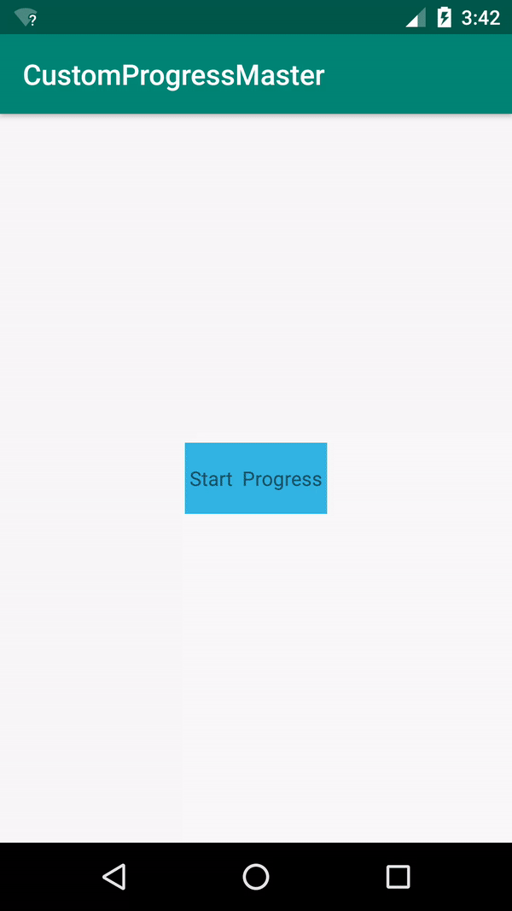
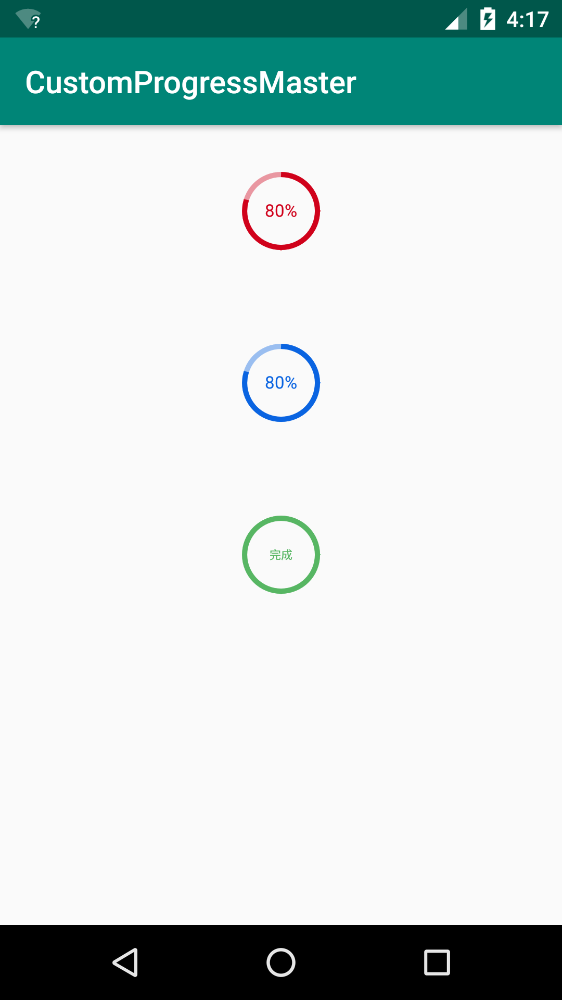

# CustomProgressMaster
Simple custom progress bar.


### Play Movies

 </img>

### CustomProgressMaster sample

</img>


## Build

Add the following to your app's build.gradle:

```groovy
dependencies {
      implementation 'com.github.futureLix:CustomProgressMaster:v1.0'
}
```
## How to use


#### Add the following XML:

```xml
<LinearLayout
    xmlns:android="http://schemas.android.com/apk/res/android"
    xmlns:app="http://schemas.android.com/apk/res-auto"
    xmlns:tools="http://schemas.android.com/tools"
    android:layout_width="match_parent"
    android:layout_height="match_parent"
    android:orientation="vertical"
    tools:context=".ExampleActivity">

    <example.com.customprogressmaster.CustomProgress
        android:id="@+id/mProgressZero"
        android:layout_width="50dp"
        android:layout_height="50dp"
        android:layout_gravity="center_horizontal"
        android:layout_margin="30dp"
        app:mBackGround="@color/progress_bg1"
        app:mForeGround="@color/progress_bg2"
        app:mTextSize="@dimen/text_size"/>

    <example.com.customprogressmaster.CustomProgress
        android:id="@+id/mProgressOne"
        android:layout_width="50dp"
        android:layout_height="50dp"
        android:layout_gravity="center_horizontal"
        android:layout_margin="30dp"
        app:mBackGround="@color/progress_bg4"
        app:mForeGround="@color/progress_bg5"
        app:mTextColor="@color/progress_bg4"
        app:mTextSize="@dimen/text_size"/>

    <example.com.customprogressmaster.CustomProgress
        android:id="@+id/mProgressTwo"
        android:layout_width="50dp"
        android:layout_height="50dp"
        android:layout_gravity="center_horizontal"
        android:layout_margin="30dp"/>
</LinearLayout>
```

#### Create :

```java
public class ExampleActivity extends AppCompatActivity {

    @Override
    protected void onCreate(Bundle savedInstanceState) {
        super.onCreate(savedInstanceState);
        setContentView(R.layout.activity_example);
        bindView();
    }

    private void bindView() {
        CustomProgress myProgressZ = findViewById(R.id.mProgressZero);
        myProgressZ.setmShowProgress(80);
        myProgressZ.setShowProgressTime(100);
        CustomProgress myProgressO = findViewById(R.id.mProgressOne);
        myProgressO.setmShowProgress(80);
        CustomProgress myProgressT = findViewById(R.id.mProgressTwo);
        myProgressT.setmShowProgress(100);
        myProgressT.setBackgroundColor(ContextCompat.getColor(this, R.color.progress_bg6));
        myProgressT.setForeground(ContextCompat.getColor(this, R.color.progress_bg7));
        myProgressT.setText("完成");
        myProgressT.setTextColor(ContextCompat.getColor(this, R.color.progress_bg6));
        myProgressT.setTextIsDisplayable(false);
    }
}
```
